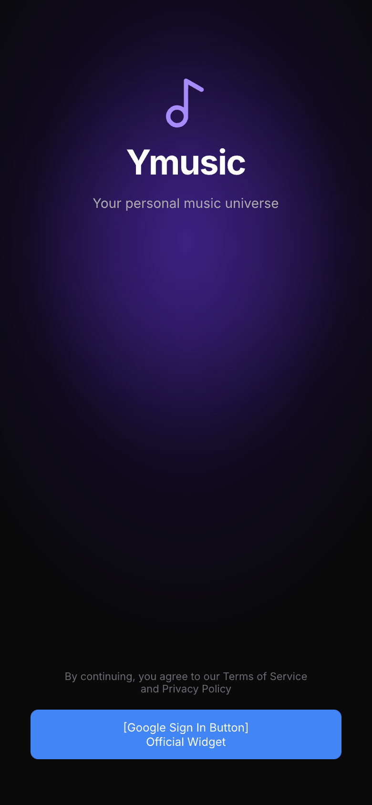

## **Status:**
- Review: Approved
- PR: Draft

## Metadata
- **Title:** LoginScreen + Google button + error handling
- **Phase:** Phase 1 – Authentication & Routing
- **GitHub Issue:** #23

---

## Description
Xây dựng màn hình đăng nhập cho phép user sign in bằng Google Account.

- Thiết kế `LoginScreen` với logo app, tagline, và nút "Sign in with Google"
- **Sử dụng official `google_sign_in` plugin's button widget** để tuân thủ Google Brand Guidelines
- Gọi `authDatasource.signInWithGoogle()` khi nhấn nút
- Hiển thị loading indicator trong khi đang xử lý
- Hiển thị SnackBar lỗi khi login thất bại (cancel, network error, v.v.)
- Sau khi login thành công → go_router tự redirect (qua `authStateProvider`) về Home
- Dark mode mặc định, glassmorphism/blur background

---

## Design
- File: `specs/designs/ymusic_design.pen`
- Màn hình: Login Screen

---

## Acceptance Criteria
- [ ] Màn hình hiển thị logo và nút "Sign in with Google" đúng design
- [ ] Nhấn nút → khởi chạy Google Sign In flow
- [ ] Loading indicator hiển thị trong khi xử lý
- [ ] Khi thành công → redirect về Home (không còn back về Login)
- [ ] Khi thất bại (cancel / lỗi) → hiện SnackBar với thông báo phù hợp
- [ ] Không crash khi user cancel Google Sign In
- [ ] `flutter analyze` — 0 warnings

---

## Implementation Checklist
- [ ] Tạo `lib/features/auth/presentation/screens/login_screen.dart`
- [ ] Thiết kế UI: logo, tagline layout (theo design)
- [ ] Add official `google_sign_in` button widget (from google_sign_in package)
- [ ] Connect với `authDatasourceProvider` qua `ConsumerWidget` / `ConsumerStatefulWidget`
- [ ] Implement loading state (bool isLoading) — disable button while loading
- [ ] Implement error handling → SnackBar (show error message)
  - [ ] Handle cancel (user dismissed Google Sign In dialog)
  - [ ] Handle network errors
  - [ ] Handle Firebase auth errors
- [ ] Extract widget nếu > 50 lines
- [ ] Thêm const constructors
- [ ] flutter analyze — 0 warnings
- [ ] Viết widget test cơ bản

---

## Notes
- **Google Sign In button:** Dùng official `google_sign_in` widget button (không dùng custom icon)
  - Đảm bảo brand compliance 100%
  - Xử lý edge cases (network error, cancel) tự động
  - Tích hợp sẵn accessibility
  - Không cần lo trademark/legal issues
- Redirect sau login được xử lý bởi go_router redirect logic (1.5), không navigate thủ công trong LoginScreen
- Design ref: `specs/designs/ymusic_design.pen` — UI layout (logo, tagline), button styling từ official widget
- Depends on: 1.1 (AuthDatasource), 1.2 (authProvider), 1.5 (go_router)

## Screenshots

### Login Screen Design

**Design Reference:** `specs/designs/ymusic_design.pen`

| Screen Name | Navigation Steps | Expected State |
|---|---|---|
| login | App launches when not authenticated | Logo visible, "Sign in with Google" button visible, dark background with glassmorphism effect |
